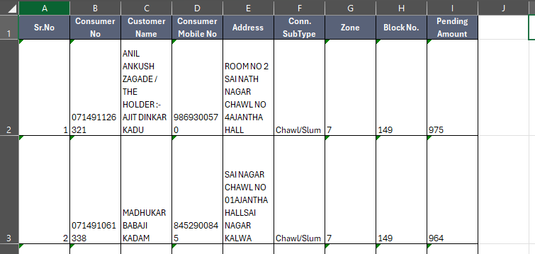
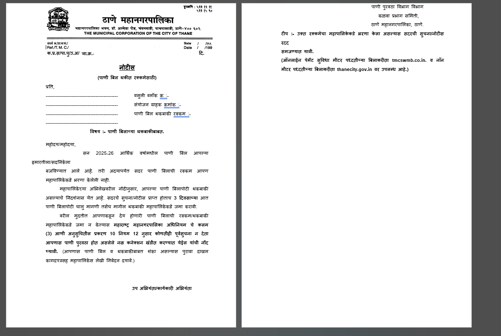

# 🚀 PROJECT PLAN — TMC Overdue Notice Generator

## 🧾 Overview

Build a **web-based utility** that allows TMC staff to:

1. Upload an Excel file containing customer data
2. Generate **individual Marathi PDF notices (1 per row)**
3. Download or share each notice via WhatsApp (manual share, no API)

---

# 🎯 Functional Requirements

## 1. Excel Upload

* Accept `.xlsx` / `.xls`
* Required columns:

  * Sr.No
  * Consumer No
  * Customer Name
  * Consumer Mobile No
  * Address
  * Conn. SubType
  * Zone
  * Block No.
  * Pending Amount

  

---

## 2. Data Mapping

Each Excel row maps to:

```json
{
  "customerName": "",
  "address": "",
  "consumerNo": "",
  "blockNo": "",
  "pendingAmount": "",
  "mobileNo": ""
}
```

---

## 3. Notice Template (STRICT — from provided doc)

The PDF must follow this exact structure:



---

### 📄 HEADER

```text
क.प्र.स/पा.पु/उ.अ/ जा.क्र.- ____________     दि. ____________
```

---

### 📄 TITLE

```text
नोटीस
(पाणी बिल थकीत रक्कमेसाठी)
```

---

### 📄 DYNAMIC SECTION (IMPORTANT)

Replace dashed placeholders:

```text
प्रति,

{{Customer Name}}              वसुली ब्लॉक क्र :- {{Block No}}

{{Address}}                   संयोजन ग्राहक क्रमांक :- {{Consumer No}}

                               पाणी बिल थकबाकी रक्कम :- {{Pending Amount}}

```

---

### 📄 SUBJECT

```text
विषय :- पाणी बिलाच्या थकबाकीबाबत.
```

---

### 📄 BODY (STATIC TEXT — DO NOT MODIFY)

Use exact Marathi content from document 

---

### 📄 SIGNATURE

```text
उप अभियंता/कार्यकारी अभियंता

पाणी पुरवठा विभाग विभाग

कळवा प्रभाग समिती,
ठाणे महानगरपालिका, ठाणे.
```

---

### 📄 FOOTER NOTE

```text
टीप :- उक्त रक्कमेचा महापालिकेकडे भरणा केला असल्यास सदरची सुचना/नोटीस रदद समजण्यात यावी.

(ऑनलाईन पेमेंट सुविधा...)
```

---

# 🖼️ 4. PDF DESIGN REQUIREMENTS

## Layout

* A4 size
* Left-aligned Marathi text
* Proper spacing between sections

## Styling

* Title: Bold + Centered
* Section labels aligned properly
* Maintain government-document format

## Logo

* TMC logo at top-left
* Fixed position

---

## 🔤 Font Requirement (CRITICAL)

* Use: **Noto Sans Devanagari (TTF)**
* Must be embedded in PDF
* Ensure:

  * Marathi renders correctly
  * No broken characters

---

# 🧩 SYSTEM ARCHITECTURE

```text
Frontend (Browser)
   ↓
Excel Upload (File Input)
   ↓
SheetJS Parser
   ↓
Template Engine (JS)
   ↓
PDF Generator (jsPDF + Embedded Font)
   ↓
Actions:
   ├── Download PDF
   └── Share via WhatsApp
```

---

# ⚙️ MODULES

## 🔹 Module 1 — File Upload

* Input: Excel file
* Validate:

  * Required columns present
  * File not empty

---

## 🔹 Module 2 — Excel Parser

* Library: SheetJS (xlsx)
* Convert sheet → JSON

---

## 🔹 Module 3 — Template Engine

* Replace placeholders:

  * `{{Customer Name}}`
  * `{{Address}}`
  * `{{Consumer No}}`
  * `{{Block No}}`
  * `{{Pending Amount}}`

---

## 🔹 Module 4 — PDF Generator

### Responsibilities:

* Create A4 document
* Insert:

  * Logo
  * Header
  * Marathi content
* Maintain formatting consistency

---

## 🔹 Module 5 — Actions per Row

For each generated notice:

### 📥 Download

* File name format:

```text
NOTICE_<ConsumerNo>.pdf
```

---

### 📤 WhatsApp Share

#### Mobile (Primary)

Use Web Share API:

```js
navigator.share({
  files: [pdfFile],
  title: "TMC Notice"
});
```

---

#### Desktop (Fallback)

* Download PDF
* Open WhatsApp Web with prefilled message:

```text
Please find your TMC water bill notice.
```

---

# 🧑‍💻 USER FLOW

```text
1. User uploads Excel
2. System validates file
3. Preview first record
4. User clicks Generate
5. For each row:
      → Generate PDF
      → Show buttons:
            [Download] [Share]
```

---

# ⚠️ CONSTRAINTS

## ❗ WhatsApp Limitation

* Cannot auto-attach PDF without API
* User must manually select file (desktop)

---

## ❗ Font Rendering

* Must embed Devanagari font
* Otherwise text breaks

---

## ❗ File Size

* Limit Excel rows (recommended: 500 max)

---

# 🔐 VALIDATIONS

| Field          | Rule        |
| -------------- | ----------- |
| Customer Name  | Required    |
| Address        | Required    |
| Consumer No    | Required    |
| Pending Amount | Must be > 0 |
| Mobile         | 10 digits   |

---

# 🚀 PHASE PLAN

## 🟢 Phase 1 (MVP)

* Upload Excel
* Parse data
* Generate single PDF per row
* Download option

---

## 🟡 Phase 2

* Add logo 
* Add proper Marathi formatting
* Embed font

---

## 🔵 Phase 3

* Add WhatsApp share (Web Share API)
* Desktop fallback

---

## 🟣 Phase 4 (Optional Enhancements)

* Bulk ZIP download
* Progress loader
* Error logs

---

---

# 📦 DELIVERABLES

* HTML page
* JS logic
* CSS styling
* Font file (TTF)
* Logo asset
* Template configuration

---
